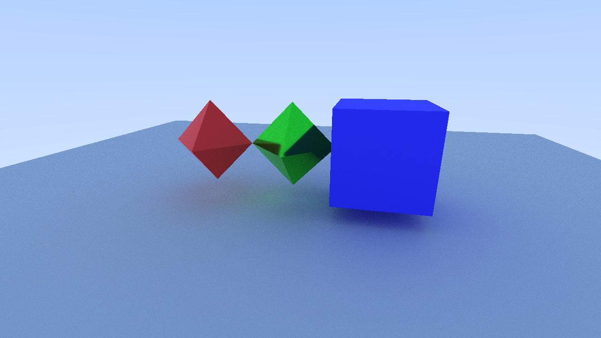

# DEV LOG by MinusModulo

## 2025-11-26

### Overview

- 实现了 path tracing + BRDF + MIS 的渲染 pipeline。
- 目前的实现效果
- 可以看到还是有很多很多很多的噪点（在金属方块上面），目测算法实现有点问题，需要改一下。
- 离远了就不能看了。 
- 还有一个问题是边缘的 aliasing 很严重。

### Details

- path tracing 的停止是基于 Russian Roulette 的。
- BRDF 采用的是 Cook-Torrance 模型，包含 diffuse 和 specular 两个部分。
- diffuse 部分采用 Lambert 模型，采样策略是余弦加权采样。
- specular 部分采用 GGX 模型，采样策略是 GGX 采样。
- 采用了 Multiple Importance Sampling (MIS) 来结合 diffuse 和 specular 两个采样策略。
- 采样策略的选择概率 q_spec 是根据 Fresnel 计算出来的。

- 本来想要实现直接光源采样的，结果有点搞错。应该采样所有光源而不是所有发光物体。搞了一晚上...

